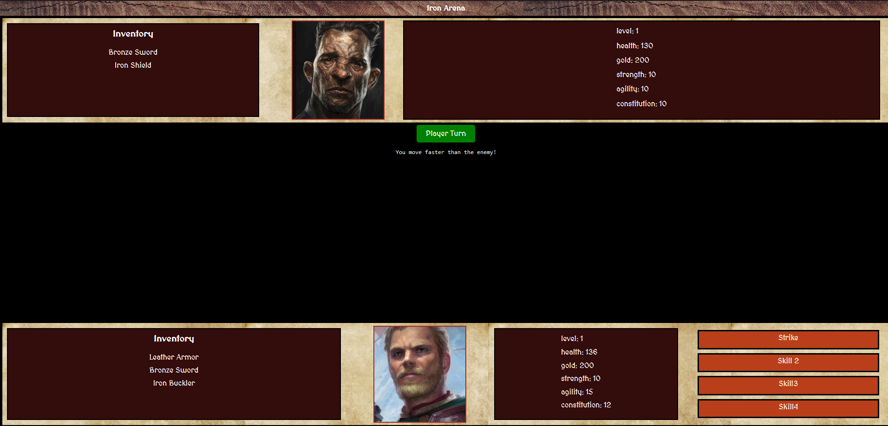

# Iron Arena - a gladiator role-playing game of guts and glory

## Description

"Welcome to Ironhill, a magnificent city nestled high amidst the awe-inspiring mountains. Prepare yourself for an exhilarating journey into the heart of gladiatorial combat."

Iron Arena is a simple browser Role-playing Game (RPG) where you play as one of three characters fighting for gold in glory in the fantastical city of Ironhill.

Built with logic for attacking and parrying with variable results based on equations that take into account the statistics of the fighter.
Created with scalability in mind, using Object Oriented Programming principals and dynamically updating UI-elements like the Health and the unit's Inventory.

## Instructions to Play

The game is click-based so very simple to understand: just follow the prompts and click the buttons on screen.

## Demo

Play the game [here](https://filipemgf.github.io/ironhack-project1-ironArena/).
